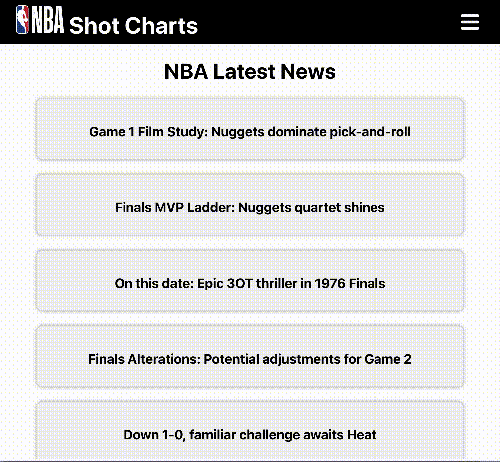
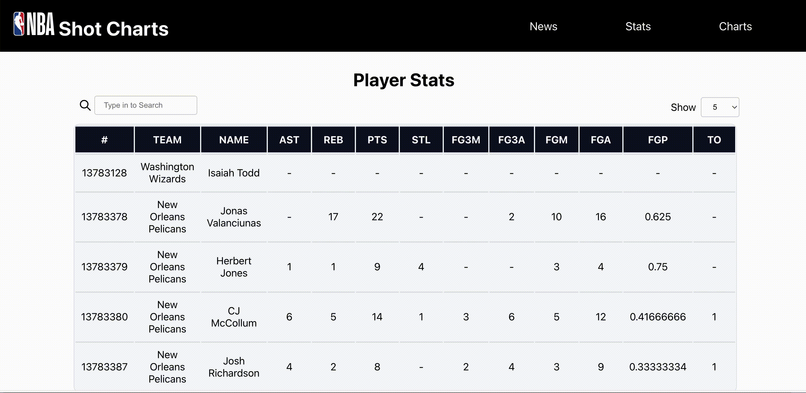
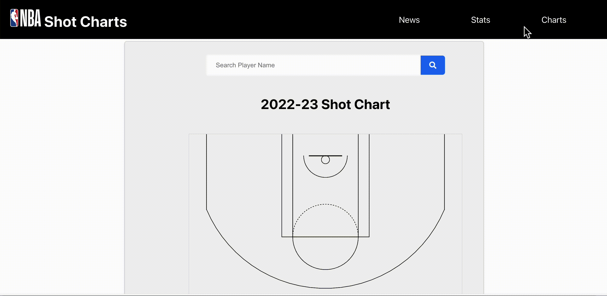

# NBA App


&nbsp;

## Descriptions

This application is a React-based web application that provides NBA news, player statistics, and player shot charts.
Users can check the latest NBA news and view the statistics and shot charts of specific players.

<br>


## Features

- NBA News Check
   - Fetches the latest NBA news through an API and displays news title.
   - Click news box and go to nba.com news.
- Player Statistics Lookup
   - Retrieves player statistics data from the API and presents it.
- Player Shot Chart 
   - Visualizes the shot chart of the selected player in Player stats page.

<br>

<div align=left> 



</div>


## Installation and Setup

### Steps to install and run the project:
   ```
   git clone https://github.com/peachpotato6/NBA-nss.git
   cd NBA-nss
   npm install
   ```
   
   * Obtain API key in [RAPID-API](https://rapidapi.com/hub)
   
   * Make a file name .env
   
   * Add API key in .env like this.
   
    REACT_APP_API_KEY=[API KEY]
   
   * Finally, run the project
   
    npm start
    

<br>


## Technologies and Libraries Used

<div align=left> 
 


<br>
</div>

<br>

## API Usage

This application utilizes the API provided by [RAPID-API](https://rapidapi.com/hub). You need to obtain an API key and set it as an environment variable in your project.

<br>

## Contributing

If you would like to contribute to this project, you can participate in the following ways:

1. Fork this repository.
2. Create a new branch.
3. Commit and push your changes.
4. Create a pull request.
